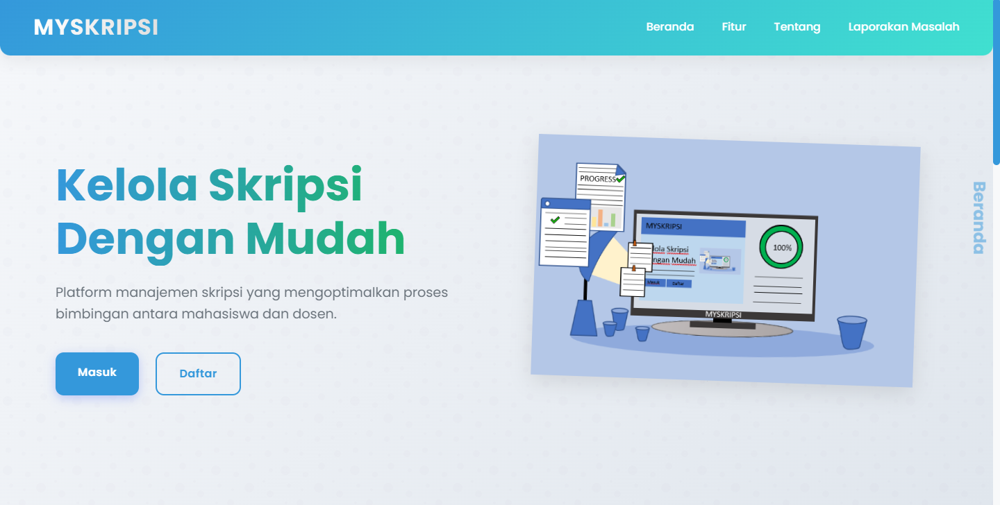
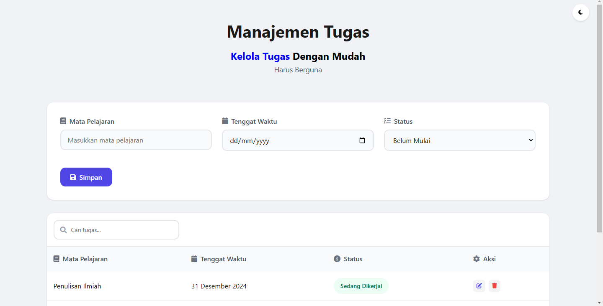

# Pustaka Proyek Terbuka


[](https://github.com/levi50421905/kode-porto/stargazers)
[](https://github.com/levi50421905/kode-porto/network/members)
[](https://github.com/levi50421905/kode-porto/issues)
[](https://github.com/levi50421905/kode-porto/blob/main/LICENSE)

> Kumpulan proyek open source untuk digunakan publik

## Daftar Isi

- [Tentang Repository](#tentang-repository)
- [Struktur Repository](#struktur-repository)
- [Daftar Proyek](#daftar-proyek)
- [Cara Menggunakan](#cara-menggunakan)
- [Kontribusi](#kontribusi)
- [Lisensi](#lisensi)
- [Kontak](#kontak)

## Tentang Repository

Repository ini berisi berbagai proyek yang telah dikembangkan dan dibagikan untuk digunakan oleh publik. Setiap folder berisi proyek yang berbeda dengan dokumentasi dan kode yang lengkap.

## Struktur Repository

```
root/
│
├── images/                 # Gambar untuk README utama
│   └── icon1.png
│
├── ProyekA
│
├── ProyekB
│
├── ProyekC
│
├── LICENSE                 # Lisensi repository
└── README.md               # File ini
```

## Daftar Proyek

*CRUD_CI3
*TODOLIST

## Cara Menggunakan

### Clone Repository Lengkap

```bash
git clone https://github.com/levi50421905/kode-porto.git
cd repository
```

### Unduh Proyek Tertentu

```bash
# Menggunakan svn untuk mengunduh folder tertentu dari GitHub
svn checkout https://github.com/username/repository/trunk/ProyekA
cd ProyekA
```

### Menjalankan Proyek

Setiap proyek memiliki instruksi menjalankan spesifik yang dapat ditemukan di README masing-masing proyek.

## Lisensi

Repository ini dilisensikan di bawah [Nama Lisensi]. Silakan lihat file [LICENSE](LICENSE) untuk informasi lebih lanjut.

## Kontak

Nama Anda - [@LeviAlfarezzi](https://instagram.com/levialfrz_) - levialfarezzi.dev@gmail.com

Project Link: [https://github.com/username/repository](https://github.com/username/repository)

---




Terakhir diperbarui: Mei 2025
